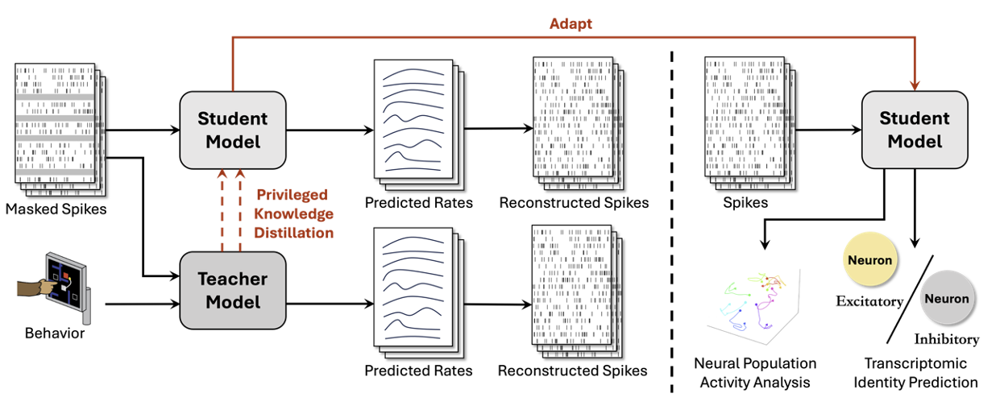

# BLEND (ICLR'2025)

**BLEND: Behavior-guided Neural Population Dynamics Modeling via Privileged Knowledge Distillation** \
*Zhengrui Guo, Fangxu Zhou, Wei Wu, Qichen Sun, Lishuang Feng, Jinzhuo Wang**, *and Hao Chen**

[[ArXiv]](https://arxiv.org/abs/2410.13872)



### News
- 2025.04.22: The model and training/evaluation codes have been released!
- 2025.01.23: Our paper is accepted by ICLR 2025! 🎉

## Acknowledgment
This codebase is based on [Neural-Data-Transformer](https://github.com/snel-repo/neural-data-transformers) and [nlb_tools](https://github.com/neurallatents/nlb_tools). Many thanks to the authors of these great projects!

## 1. Installation & Environment
Please refer to [Neural-Data-Transformer](https://github.com/snel-repo/neural-data-transformers) and [nlb_tools](https://github.com/neurallatents/nlb_tools) for detailed installation and environment requirements.

## 2. Dataset
Please download NLB'21 Benchmark from the official website [here](https://neurallatents.github.io/). The MC-Maze Subset from NLB'21 Benchmark will be used to exemplify our method in the following sections.

## 2. Reproduce BLEND
This repository is based on the Pytorch version of the BLEND implementation.

We have provided the model implementation, training, and evaluation code, with detailed instructions shown as follows:

### 2.1 Training & Evaluation of Baseline Models
Run the following script for original neural-data-transformer or LFADS model training on MC-Maze Dataset:
```
git clone https://github.com/dddavid4real/BLEND
cd BLEND
bash scripts/train.sh
```

For evaluation on the test set, please run:
```
bash scripts/eval.sh
```

### 2.2 Training & Evaluation of Teacher-Student Model via Privileged Knowledge Distillation
#### 2.2.1 Hard Label Distillation
Run the following script for training hard-label distillation on MC-Maze Dataset:
```
bash scripts/train_lupi.sh
```

For evaluation on the test set, please run:
```
bash scripts/eval_lupi.sh
```

#### 2.2.2 Soft Label Distillation / Feature Distillation / Correlation Distillation
Before running the training or evluation scripts for these three types of distillation frameworks, please specifify which distillation strategy you intend to use by setting the indicator to `True` in `configs/mc_maze_LUPI_soft.yaml`:
```
TRAIN:
  ...
  SOFT_DISTILLATION: True #* Soft Label Distillation
  # FEATURE_DISTILLATION: True #* Feature Distillation
  # CORRELATION_DISTILLATION: True #* Correlation Distillation
  ...
```
After this, run the following script for training soft-label/feature/correlation distillation on MC-Maze Dataset:
```
bash scripts/train_lupi_soft.sh
```

For evaluation on the test set, please run:
```
bash scripts/eval_lupi_soft.sh
```

## Issues
- Please open new threads or report issues directly (for urgent blockers) to `zguobc@connect.ust.hk`
- Immediate response to minor issues may not be available

## Reference
If you find our work useful in your research, please consider citing our paper at::
```
@inproceedings{guo2024blend,
  title={BLEND: Behavior-guided Neural Population Dynamics Modeling via Privileged Knowledge Distillation},
  author={Guo, Zhengrui and Zhou, Fangxu and Wu, Wei and Sun, Qichen and Feng, Lishuang and Wang, Jinzhuo and Chen, Hao},
  booktitle={The Thirteenth International Conference on Learning Representations,
                  {ICLR} 2025, Singapore, April 24-28, 2025},
  publisher={OpenReview.net},
  year={2025},
}
```